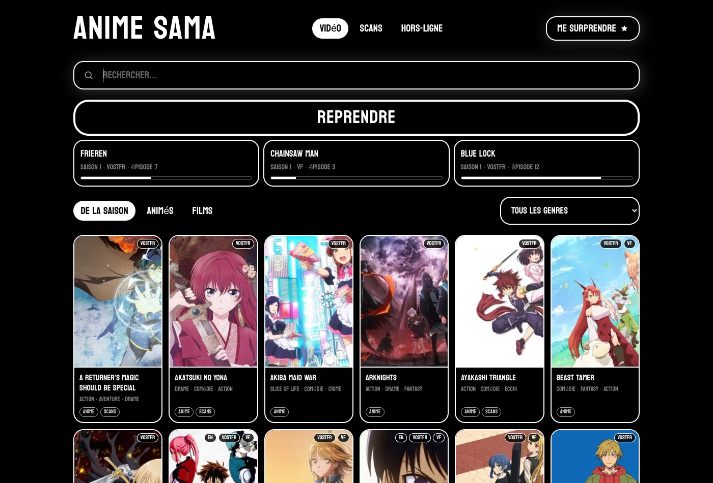
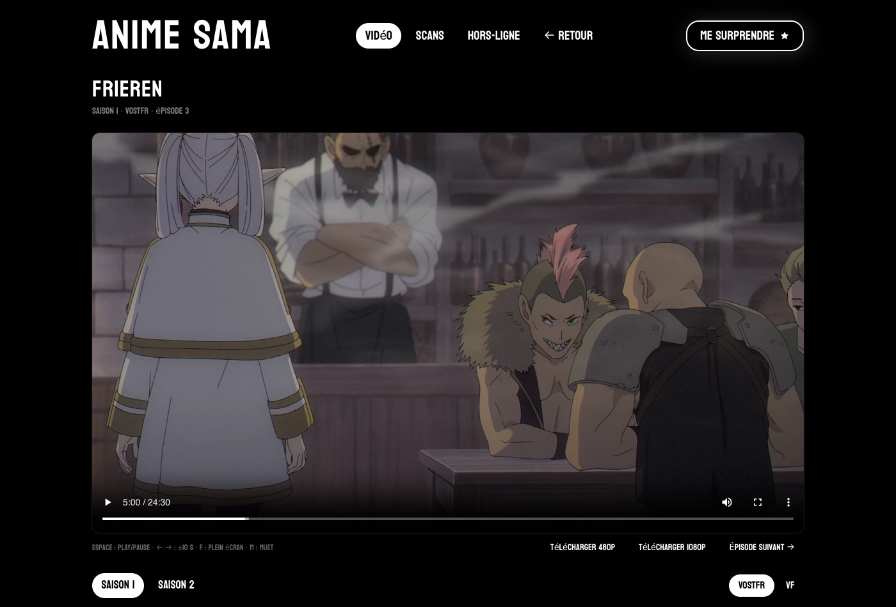
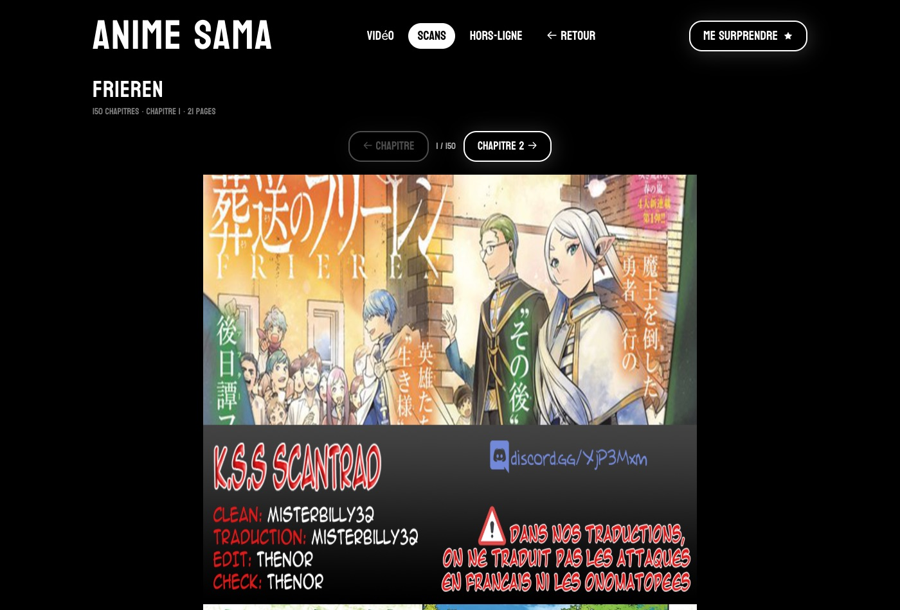
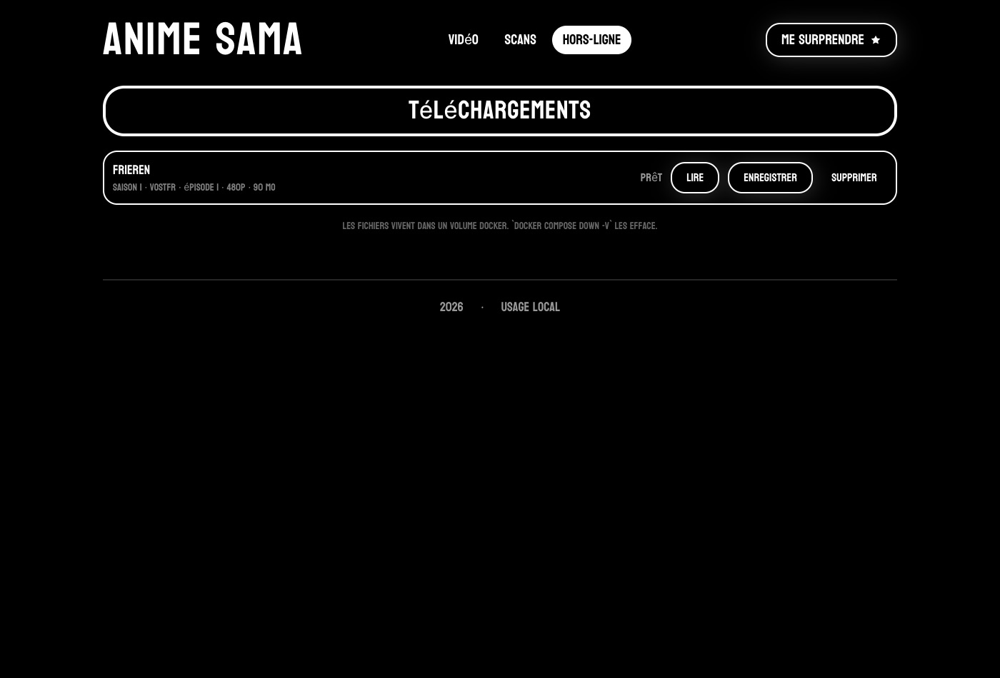

# Anime Sama — API & application locale

Application **auto-hébergée** pour regarder les animés et lire les scans
d'anime-sama : interface épurée, lecteur natif, **aucune pop-up**, aucun lecteur
tiers. Tout tourne sur ta machine.



## Démarrage en 30 secondes

Il te faut seulement **Docker Desktop**, lancé.

```bash
git clone https://github.com/oskano14/AnimeSamaApi.git
cd AnimeSamaApi
docker compose up -d
```

Puis **<http://localhost:8080>**. C'est tout — pas de compte, pas de clé d'API,
rien d'autre à installer.

**→ Guide complet, réglages et dépannage : [INSTALL.md](INSTALL.md)**

## Ce que ça fait

| | |
|---|---|
| **Vidéo** | catalogue (de la saison / animés / films), 109 genres, recherche floue, lecteur HLS, reprise de lecture, épisode suivant automatique |
| **Scans** | catalogue, lecteur en défilement, reprise de lecture |
| **Hors-ligne** | téléchargement d'un épisode en `.mp4` (480p ou 1080p) via ffmpeg, lisible sans connexion |
| **API** | REST, utilisable seule — [voir les endpoints](#endpoints-de-lapi) |

Le tout dans deux conteneurs : l'API Python qui scrape et résout les liens, et
le front React servi par nginx.

### Le lecteur

Flux direct en `m3u8`/`mp4`, dans un `<video>` natif avec hls.js. Reprise à la
seconde près, épisode suivant enchaîné, raccourcis clavier, et téléchargement
hors-ligne en un clic.



### Les scans

Lecture en défilement continu, chargement des pages au fil du scroll.



### Le hors-ligne

Mux `ffmpeg` en copie de flux : un épisode de 26 min est prêt en moins d'une
minute, sans ré-encodage ni perte.



---

## Table des matières

1. [Présentation](#présentation)
2. [Installation](#installation)
3. [Architecture du projet](#architecture-du-projet)
4. [Démarrage rapide](#démarrage-rapide)
5. [Endpoints de l'API](#endpoints-de-lapi)
6. [Exemples d'utilisation](#exemples-dutilisation)
7. [Gestion des erreurs](#gestion-des-erreurs)
8. [Limitations et notes techniques](#limitations-et-notes-techniques)
9. [Patch](#patch)

---

## Présentation

Cette API REST permet de rechercher, récupérer et accéder aux informations d'animes depuis le site anime-sama. Elle propose des fonctionnalités de recherche intelligente, de récupération de métadonnées et d'extraction de liens de lecture.

### Fonctionnalités principales

- Catalogue complet d'animes avec titres alternatifs
- Recherche floue avec scoring intelligent
- Récupération d'informations détaillées par anime
- Extraction automatique des liens (Mp4/M3U8) via résolveurs HTTP-only
- Support multi-saisons et multi-versions (VOSTFR/VF)
- L'api peut tout à fait traiter les saisons / films / OAV tant qu'ils existent

---

## Installation

### Prérequis

- Python 3.8 ou supérieur
- pip (gestionnaire de paquets Python)

### Dépendances

Installez les dépendances nécessaires :

```cmd
pip install -r requirements.txt
```

### Structure des fichiers

Assurez-vous que votre projet respecte cette structure :

```
projet/
├── main.py
├── src/
│   ├── api.py
│   ├── backend.py
│   └── utils/
│       ├── resolvers.py
│       └── utils.py
└── data/
    └── json/
        └── AnimeInfo.json (généré automatiquement)
```

---

## Architecture du projet

### Composants principaux

| Fichier | Rôle |
|---------|------|
| `main.py` | Point d'entrée de l'application |
| `api.py` | Définition des routes Flask |
| `backend.py` | Logique métier et scraping |
| `resolvers.py` | Résolution HTTP-only des liens Sibnet, Vidmoly, SmoothPre, SendVid |
| `utils.py`| Utilitaire pour la récupération automatique de l'url actif |

### Flux de données

```
Requête HTTP → Flask (api.py) → Cardinal (backend.py) → Scraping/Recherche → Réponse JSON
```

---

## Démarrage rapide

### Avec Docker (le plus simple)

```bash
docker compose up -d
```

Puis ouvrir **http://localhost:8080**. C'est tout : deux conteneurs démarrent.
Guide détaillé et dépannage dans **[INSTALL.md](INSTALL.md)**.

| Conteneur | Rôle | Accès |
|---|---|---|
| `api` | Flask servi par waitress | `http://localhost:5001` (debug) |
| `web` | Front React buildé, servi par nginx | `http://localhost:8080` |

Le front appelle `/api` en relatif ; nginx proxifie vers le conteneur `api` sur
le réseau interne. Tout est en **même origine**, donc aucun CORS à configurer en
local. `CORS_ORIGINS` ne sert que si un front externe (Vercel) tape l'API en
direct.

```bash
docker compose logs -f api   # suivre les logs
docker compose down          # arrêter (le catalogue survit)
docker compose down -v       # arrêter et vider le catalogue
```

Deux détails qui expliquent les choix du compose :

- **L'API est publiée sur 5001, pas 5000** : sur macOS le Centre de contrôle
  (Receiver AirPlay) occupe déjà 5000 et le bind Docker échoue. Surchargeable
  via `API_PORT=5002 docker compose up -d`. En interne c'est toujours 5000.
- **`requirements.txt` ne liste que les dépendances réelles** (8 paquets). Il a
  été nettoyé d'un `pip freeze` de 56 paquets — FlareSolverr, DrissionPage,
  openpyxl… — qu'aucun import ne référençait : 40 Mo de deps au lieu de 105 Mo.

### Sans Docker

```python
python main.py
```

Par défaut, l'API démarre sur `http://127.0.0.1:5000` en mode debug. Pour le
front, voir [frontend/README.md](frontend/README.md).

### Configuration personnalisée

```python
from main import Api

# Lancer sur un port différent sans debug
Api.launch(port=5001, debug_state=False, reload_status=False)
```

### Première utilisation

Avant d'utiliser les fonctions de recherche, initialisez la base de données :

```cmd
curl "http://127.0.0.1:5000/api/getAllAnime"
```

**Attention** : Cette opération peut prendre plusieurs minutes lors de la première exécution.

---

## Endpoints de l'API

### 1. Route de test

**GET** `/`

Vérifie que l'API fonctionne correctement.

**Paramètres** :
- `q` (obligatoire) : Chaîne de test

**Exemple** :
```
http://127.0.0.1:5000/?q=test
```

**Réponse** :
```json
{
  "Bonjours": "Je suis une api...",
  "Valeur q": "test",
  "Cardinal value": "Cardinal.test()"
}
```

---

### 2. Récupération du catalogue complet

**GET** `/api/getAllAnime`

Scrap et stocke tous les animes disponibles dans un fichier JSON local.

**Paramètres** :
- `r` (optionnel) : `True` pour forcer la mise à jour du catalogue entier

**Exemple** :
```
http://127.0.0.1:5000/api/getAllAnime?r=True
```

**Réponse** :
```json
"Recuperation achevee : 2319 animes"
```

**Note** : Le fichier généré se trouve dans `src/data/json/AnimeInfo.json` (~2300 animes,
une quinzaine de secondes de scraping). Il n'est plus nécessaire de l'appeler à la main :
`/api/getSerchAnime` reconstruit le catalogue tout seul s'il est absent, périmé (changement
de domaine anime-sama) ou écrit dans un ancien schéma.

Chaque entrée porte les mêmes champs que les `items` de [`/api/getCatalogue`](#10-catalogue-filtré-les-catégories)
(`title`, `link`, `image`, `alt_titles`, `genres`, `types`, `langues`).

---

### 3. Chargement de la base locale

**GET** `/api/loadBaseAnimeData`

Retourne le contenu du fichier `AnimeInfo.json`.

**Exemple** :
```
http://127.0.0.1:5000/api/loadBaseAnimeData
```

**Réponse** :
```json
[
  {
    "title": "Frieren",
    "AlterTitle": "Sousou no Frieren",
    "link": "https://anime-sama.org/catalogue/frieren/"
  },
  ...
]
```

---

### 4. Recherche d'animes

**GET** `/api/getSerchAnime`

Recherche des animes par nom avec algorithme de correspondance floue.

**Paramètres** :
- `q` (obligatoire) : Terme de recherche
- `l` (optionnel) : Limite de résultats (défaut : 5)

**Exemple** :
```
http://127.0.0.1:5000/api/getSerchAnime?q=Frieren&l=3
```

**Réponse** :
```json
[
  {
    "title": "Frieren",
    "lien": "https://anime-sama.org/catalogue/frieren/",
    "score": 95
  },
  {
    "title": "Sousou No Frieren",
    "lien": "https://anime-sama.org/catalogue/sousou-no-frieren/",
    "score": 88
  }
]
```

**Algorithme de scoring** :
- Score de base : similarité token_set_ratio (RapidFuzz)
- Bonus de spécificité : +10 si longueur similaire (ratio 0.9-1.1)
- Pénalité : -15 si titre trop court (ratio < 0.5)
- Seuil minimum : 75

---

### 5. Informations détaillées d'un anime

**GET** `/api/getInfoAnime`

Récupère toutes les saisons disponibles pour un anime.

**Paramètres** :
- `q` (obligatoire) : Nom de l'anime

**Exemple** :
```
http://127.0.0.1:5000/api/getInfoAnime?q=Demon Slayer
```

**Réponse** :
```json
[
  {
    "base_url": "https://anime-sama.org/catalogue/demon-slayer/",
    "title": "Demon Slayer",
    "Saison": "Saison 1",
    "url": "https://anime-sama.org/catalogue/demon-slayer/saison1/"
  },
  {
    "base_url": "https://anime-sama.org/catalogue/demon-slayer/",
    "title": "Demon Slayer",
    "Saison": "Saison 2",
    "url": "https://anime-sama.org/catalogue/demon-slayer/saison2/"
  }
]
```

---

### 6. Récupération d'une saison spécifique

**GET** `/api/getSpecificAnime`

Retourne les informations d'une saison particulière.

**Paramètres** :
- `q` (obligatoire) : Nom de l'anime
- `s` (optionnel) : Saison (défaut : `saison1`)
- `v` (optionnel) : Version (défaut : `vostfr`)

**Exemple** :
```
http://127.0.0.1:5000/api/getSpecificAnime?q=One%20Piece&s=saison1&v=vostfr
```

**Réponse** :
```json
{
  "base_url": "https://anime-sama.org/catalogue/one-piece/",
  "title": "One Piece",
  "Saison": "Saison 1",
  "url": "https://anime-sama.org/catalogue/one-piece/saison1/vostfr"
}
```

---

### 7. Extraction des liens de streaming

**GET** `/api/getAnimeLink`

Récupère tous les liens de streaming pour une saison complète.

**Paramètres** :
- `n` (obligatoire) : Nom de l'anime
- `s` (optionnel) : Saison (défaut : `saison1`)
- `v` (optionnel) : Version (défaut : `vostfr`)

**Exemple** :
```
http://127.0.0.1:5000/api/getAnimeLink?n=Spy%20x%20Family&s=saison1&v=vostfr
```

**Réponse** :
```json
[
  {
    "episode": 0,
    "url": "https://..."
  },
  {
    "episode": 1,
    "url": "https://..."
  }
]
```

**Note** : Cette fonction tente plusieurs lecteurs et sources pour garantir la disponibilité de tous les épisodes.

### 8. Recuperation du lien actif de anime-sama
```
http://127.0.0.1:5000/api/getAnimeSamaURL
```

**Réponse** :
```json
[
  {
    "url": "https://anime-sama.tv"
  }
]
```

**Note** : L'endpoint ici renvoie bêtement le lien actif de anime sama prete a utilisation direct pour être stocker en variable par exemple

---

### 9. Vocabulaire des filtres

**GET** `/api/getFilters`

Valeurs de filtre acceptées par le catalogue, lues dans le formulaire d'anime-sama
(pas codées en dur : c'est le site qui fait autorité). Mis en cache.

**Réponse** :
```json
{
  "types": ["Anime", "Scans", "Film", "Autres"],
  "langues": ["VOSTFR", "VF", "VASTFR"],
  "statuts": ["En cours", "Terminé"],
  "genres": ["Action", "Adolescence", "Amour", "..."]
}
```

---

### 10. Catalogue filtré (les catégories)

**GET** `/api/getCatalogue`

Catalogue filtré et paginé. Les filtres sont appliqués par anime-sama lui-même,
donc jamais de cache à resynchroniser. ~0.2 s par appel.

**Paramètres** (tous optionnels, tous répétables sauf `page`) :
- `type` : `Anime` | `Scans` | `Film` | `Autres`
- `genre` : un des 109 genres de `/api/getFilters`
- `langue` : `VOSTFR` | `VF` | `VASTFR`
- `statut` : `En cours` | `Terminé`
- `page` : défaut `1`

**Exemple** — les animés de la saison :
```
http://127.0.0.1:5000/api/getCatalogue?type=Anime&statut=En+cours
http://127.0.0.1:5000/api/getCatalogue?type=Film&genre=Action&page=2
```

**Réponse** :
```json
{
  "page": 1,
  "total": 48,
  "derniere_page": false,
  "items": [
    {
      "title": "Frieren",
      "link": "https://anime-sama.to/catalogue/frieren",
      "image": "https://cdn.jsdelivr.net/.../frieren0.webp",
      "alt_titles": "Sousou no Frieren, Frieren at the Funeral",
      "genres": ["Shônen", "Aventure", "Drame"],
      "genres_tronques": true,
      "types": ["Anime", "Scans"],
      "langues": ["JP", "FR"]
    }
  ]
}
```

**Notes** :
- `derniere_page` vaut `true` dès que la page rend moins de 48 cartes.
- `genres_tronques` signale que la carte a masqué des genres derrière un « … ».
  La liste complète n'est pas dans le catalogue.
- `alt_titles` est une **chaîne brute**, jamais découpée : le site sépare par des
  virgules mais les titres en contiennent (`'Tis Time for "Torture," Princess`).
- `langues` porte le code du drapeau (`JP` = VOSTFR dispo, `FR` = VF dispo).
- Il n'y a pas de filtre « saison » exploitable : `annee_min` existe côté site
  mais n'est presque jamais renseigné (5 titres sur 85). `statut=En cours` est
  le seul marqueur fiable de ce qui sort en ce moment.

---

### 11. Grille d'épisodes (sans résolution)

**GET** `/api/getEpisodes`

Liste les épisodes d'une saison **sans** résoudre les liens vidéo. C'est l'appel
qui remplit la grille : ~2 s, contre ~6 s si on résolvait tout.

**Paramètres** : `n` (obligatoire), `s` (défaut `saison1`), `v` (défaut `vostfr`)

**Réponse** :
```json
{
  "titre": "Frieren", "saison": "Saison 1", "version": "vostfr", "total": 28,
  "episodes": [{"episode": 0, "numero": 1, "lecteurs": ["eps2", "eps4"], "lisible": true}]
}
```

---

### 12. Lien d'un seul épisode

**GET** `/api/getEpisodeLink`

Résout **un** épisode : l'appel que fait le lecteur au clic (~0.7 s). Essaie les
lecteurs dans l'ordre et s'arrête au premier qui répond.

**Paramètres** : `n` (obligatoire), `s`, `v`, `e` (index de l'épisode, **0-based**)

**Réponse** :
```json
{
  "episode": 0, "numero": 1, "url": "https://.../master.m3u8",
  "type": "m3u8", "lecteur": "eps2", "titre": "Frieren", "saison": "Saison 1"
}
```

**Note** : les liens expirent en ~12 h (token Vidmoly) — à ne jamais mettre en
cache durablement.

---

### 13. Téléchargements hors-ligne

**GET** `/api/downloads` — liste et état.

```json
{
  "ffmpeg": true,
  "qualites": ["1080p", "480p"],
  "items": [{
    "id": "6948ddec293f", "titre": "Frieren", "saison": "Saison 1",
    "version": "vostfr", "episode": 0, "numero": 1, "qualite": "480p",
    "statut": "termine", "progres": 100, "duree": 1560.0,
    "taille": 89942309, "erreur": null,
    "url": "/videos/frieren-saison-1-vostfr-ep01-480p.mp4"
  }]
}
```

**POST** `/api/downloads` — met un épisode en file.

```bash
curl -X POST -H "Content-Type: application/json" \
  -d '{"n":"Frieren","s":"Saison 1","v":"vostfr","e":0,"q":"480p"}' \
  http://localhost:5001/api/downloads
```

`statut` : `en_attente` → `en_cours` → `termine` (ou `erreur`).

**DELETE** `/api/downloads/<id>` — annule un mux en cours, ou supprime le fichier.

**Notes** :
- ffmpeg travaille en **copie de flux** : aucun ré-encodage, ~40 s pour un
  épisode de 26 min, aucune perte de qualité.
- Poids : **~110 Mo en 480p**, **~700 Mo en 1080p** par épisode.
- Le lien source est résolu **au lancement du mux**, pas à la mise en file : le
  token Vidmoly ne vit que 12 h.
- Les `.mp4` sont servis par nginx sur `/videos/…`, avec les requêtes Range
  (donc le seek fonctionne). Un mux en cours (`.part`) n'est jamais exposé.
- Un seul mux à la fois : le goulot est le réseau, paralléliser ne gagnerait rien.

---

### 14. Sonde de santé

**GET** `/health`

Aucun appel réseau, réponse immédiate. Utilisée par le healthcheck Docker.

```json
{"status": "ok"}
```

---

## Exemples d'utilisation

### Exemple : Rechercher et récupérer un anime

```python
import requests

# 1. Rechercher l'anime
response = requests.get("http://127.0.0.1:5000/api/getSerchAnime?q=Attack%20on%20Titan&l=1")
results = response.json()
print(f"Trouvé : {results[0]['title']}")

# 2. Récupérer les saisons
anime_name = results[0]['title']
response = requests.get(f"http://127.0.0.1:5000/api/getInfoAnime?q={anime_name}")
seasons = response.json()
print(f"Saisons disponibles : {len(seasons)}")

# 3. Obtenir les liens de la saison 1
response = requests.get(f"http://127.0.0.1:5000/api/getAnimeLink?n={anime_name}&s=saison1")
links = response.json()
print(f"Épisodes disponibles : {len(links)}")
```

---

## Gestion des erreurs

### Codes d'erreur HTTP

| Code | Signification | Exemple |
|------|---------------|---------|
| 200 | Succès | Données retournées correctement |
| 400 | Paramètre manquant | `{"error": "Paramètre 'q' manquant"}` |
| 500 | Erreur serveur | Problème de scraping ou de connexion |

### Erreurs courantes

**1. Base de données non initialisée**

```json
"Fichier non existant velliez request : http://127.0.0.1:5000/api/getAllAnime"
```

**Solution** : Exécutez d'abord `/api/getAllAnime` pour créer la base locale.

**2. Aucun résultat de recherche**

```json
[]
```

**Causes possibles** :
- Orthographe incorrecte (l'algorithme tolère certaines erreurs)
- Anime non présent dans le catalogue
- Score de similarité < 75

**3. Site non supporté**

Si un hébergeur n'est pas dans la liste des sites autorisés ou échoue à la résolution, l'épisode peut être manquant dans la liste finale.

---

## Limitations et notes techniques

### Performance

- **Première récupération du catalogue** : 3-5 minutes (4000+ animes)
- **Recherche** : < 1 seconde
- **Extraction de liens** : 1-3 secondes par saison (via HTTP direct)

### Restrictions

1. **Taux de requêtes** : Pas de limite implémentée, mais Cloudflare peut bloquer en cas d'abus.
2. **Dépendance externe** : Nécessite que anime-sama.pw soit accessible

### Stratégie de fallback

L'endpoint `/api/getAnimeLink` implémente une stratégie en cascade :

1. Tente le lecteur par défaut (eps1)
2. En cas d'échec, teste tous les lecteurs disponibles
3. Utilise les résolveurs `src/utils/resolvers.py` pour extraire les liens directs sans navigateur.
4. Retourne tous les liens trouvés triés par numéro d'épisode

---

## Support et contribution

Pour toute question ou bug, vérifiez :
1. La console Flask pour les erreurs de scraping
2. La disponibilité du site source

# Patch
- Le bug lié à la mise a jour du domaine vers .eu est corriger voir l’[issue #2](../../issues/2).
- Suppression complète de Playwright.

---
